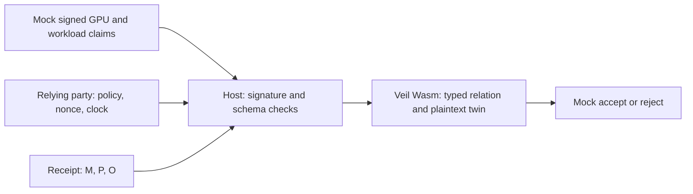

# Private inference receipts

This milestone checks a typed `(model, prompt_commit, output_commit)` receipt
against an authenticated mock NVAT-style envelope using veil's plaintext twin.
It runs locally without a GPU, network access, NVIDIA software, or npm packages.
The first consumer is a veil integrator developing the receipt protocol before
connecting an attested inference runner.

```sh
# From the veil repository root, using its existing OCaml development switch:
zsh dev/dune.sh build bin/kanon.exe
node examples/private-inference/receipt.mjs demo
```

The demo emits two JSON results: a matching receipt is accepted, and substituting
the output commitment is rejected with `output-binding`. Every result includes
`"mode": "mock"` and `"assurance": "plaintext-twin"`. This is a consistency check
over signed synthetic claims. It neither runs inference nor attests real hardware.

To inspect and edit the inputs independently:

```sh
node examples/private-inference/receipt.mjs fixture _build/receipt-demo
node examples/private-inference/receipt.mjs verify --mock \
  _build/receipt-demo/receipt.json \
  _build/receipt-demo/policy.json \
  _build/receipt-demo/context.json
node --test dev/private-inference-test.mjs
```

Fixture generation refuses to overwrite existing files. It creates an ephemeral
Ed25519 signing key, writes its public key into the mock policy, and discards the
private key. The fixture's context records its challenge and verification time
for offline reproducibility. A live relying party must supply its own current
clock. Verification exits 0 for acceptance, 1 for rejection, 2 for IO, build or
runtime errors, and 64 for incorrect arguments or missing `--mock`.

## The relation

`relation.kan` owns the decision. The host passes structured values into its
compiled WasmGC module, which has no imports. The check requires all of:

- The mock envelope authenticates under the relying party's pinned Ed25519 key.
- GPU attestation succeeds, GPU CC is enabled, and GPU debug is disabled.
- The VM is attested and confidential, VM debug is disabled, and the workload
  claims a completed inference.
- GPU measurement `G`, workload measurement, model hash `M`, and runtime match
  the independently supplied policy. Supported runtime values are `nim` and
  `tensorrt-llm`.
- The signed workload's `M`, `P`, and `O` equal the supplied receipt, and its
  GPU measurement equals the attested GPU's measurement.
- GPU and workload claims both bind the expected 32-byte challenge.
- `issued_at <= not_before <= now < expires_at`, with
  `now - issued_at <= max_age_seconds`.

`twin.kan` gives model hashes, prompt commitments, output commitments, GPU
measurements and workload measurements distinct types. Constructors reject
swapped types at compilation. The host checks 64-character lowercase hex digests
and passes bytes into arbitrary-precision naturals, preserving all 256 bits.
Times use safe integer Unix seconds and an 8-byte ABI, including values above
the direct Wasm i31 export limit.

The existing reactor's `zkProve` and `zkVerify` store and check SHA-256 digests of
the complete public instance and authenticated envelope. The instance digest
includes the receipt, policy, challenge and verification time. The witness
digest binds the exact canonical token. The plaintext twin then evaluates the
complete relation in Wasm. Changing either digest invalidates a stored slot.
Slots are local runtime values, not portable cryptographic proofs.

`proof.kan` declares `MockInferenceReceiptProof` with veil's `SZk` shape over the
same relation. `relation.kan` is separately checkable by `kanon circuit` and has
no axioms. Circuit acceptance means the term belongs to veil's finite fragment;
it does not mean a ZK or FHE backend has been implemented. In particular, the
host authentication result is an assumption at this boundary. A future proof
system must authenticate and bind the evidence, rather than letting a prover
choose a successful authentication bit.

## Commitments and mock token format

`M = SHA256(model_bytes)`. For a real multi-file model, the deployment must first
define a canonical manifest that covers weights, engine artifacts and relevant
configuration. The demo hashes synthetic model bytes.

`P` and `O` use separate domains and private random 32-byte salts:

```text
P = SHA256(UTF8("veil/prompt/v1\0") || salt_P || u64be(len(prompt)) || prompt)
O = SHA256(UTF8("veil/output/v1\0") || salt_O || u64be(len(output)) || output)
```

The helpers in `host.mjs` accept exact byte buffers. Neither openings nor salts
are included in the receipt. Callers that need later openings must retain salts
privately. A salt must be generated independently with a cryptographic RNG;
an unsalted hash can expose a low-entropy prompt to guessing.

`receipt.json` contains `version`, `mode`, the three-field `receipt`, and `token`.
The token has the fixed format `veil.mock-nvat.ed25519.v1`, a base64url canonical
JSON payload, and a 64-byte Ed25519 signature over those exact payload bytes.
Canonical JSON sorts object keys and uses compact JSON serialization. Duplicate
keys, alternate encodings, extra fields and non-boolean flags are rejected.
The payload includes separate `gpu` and `workload` claim objects, timestamps,
issuer `veil.mock-attester`, and an audience pinned by policy.

This envelope is our mock adapter contract. It is not NVIDIA's EAT/JWT wire
format, and a real NRAS token is deliberately rejected. The mock signer can
assert any synthetic claims. Its signature exercises authentication and
tamper rejection without implying NVIDIA endorsement or hardware evidence.

`G` represents a digest of an agreed canonical set of verified GPU measurements.
It is synthetic here. A real adapter must define that normalization using
verified claims and reference measurements. Hashing a nonce-dependent raw quote
and treating it as a stable firmware measurement would be incorrect.

## Trust boundary and next integration



The relying party owns the policy, public key, challenge and clock. Supplying
the receipt sender's policy would let that sender choose what is trusted.
The verifier is stateless: matching a nonce prevents substitution across
challenges, but does not consume it. A service must atomically consume accepted
challenges and maintain its own expiration and replay policy.

NVIDIA's [NVAT SDK](https://github.com/NVIDIA/attestation-sdk) supports C, CLI and
Rust interfaces and succeeds nvTrust's Python guest tools. GPU attestation
establishes the device's measured state. It does not itself identify an
inference's model, prompt or output. The documented
[Confidential Containers attestation flow](https://docs.nvidia.com/datacenter/cloud-native/confidential-containers/latest/attestation.html)
covers the CPU/GPU TEE and constrains the Kata Agent API through a workload
security policy. NVIDIA's [Hopper token example](https://docs.nvidia.com/attestation/quick-start-guide/latest/attestation-examples/hopper_single_gpu.html)
shows signed GPU claims and challenge binding, not application inference receipts.

The hardware milestone needs a measured runner inside the CVM that:

1. Collects fresh GPU evidence using NVAT and validates local-verifier or NRAS
   results, including signatures, issuer, audience, nonce, certificate status,
   measurement policy and CC state.
2. Verifies CPU/CVM attestation and the workload policy, and binds a receipt
   signing key and the GPU evidence/session into that attestation. GPU and CPU
   evidence must belong to the same protected execution context.
3. Measures the actual model artifacts and inference configuration, runs
   NIM or TensorRT-LLM, commits the actual input/output bytes, and signs the
   receipt only after completion. Workload identity and runtime names cannot
   merely be caller-supplied strings.
4. Replaces the mock adapter with authenticated normalized evidence. The
   relying party then checks the relation and consumes the challenge.

A later ZK/FHE implementation can target the commitment and measurement
relation, with range constraints and authenticated evidence binding. NVFlare
federated execution and HE/DP filters are a separate upgrade, outside this
single-inference milestone.

## Validation

`dev/private-inference-test.mjs` compiles and exercises the real veil module,
including signed negative claims, forged signatures, independently changed
policy and receipt fields, full-width digests, timestamp boundaries, proof-slot
binding, type rejection and CLI exit codes. The repository gate battery includes
these tests as `PRIVATE-INFERENCE`. See [VALIDATION.md](VALIDATION.md) for the
recorded results and source revision.
